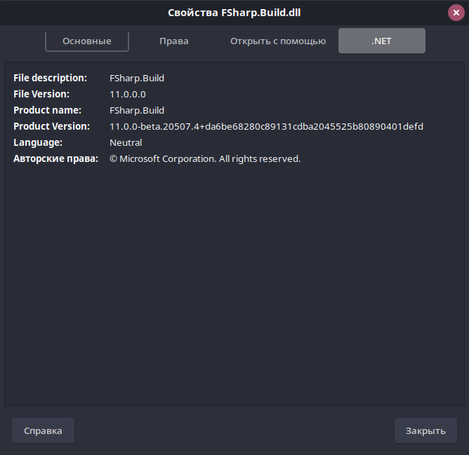

# About

The nemo extension that adds new tab to file property dialog. The tab shows .NET assembly info like 'File Description', 'Assembly Version', 'Product Name', 'Product Version', 'Language Code', 'Legal Copyright'.




# Build

To build deb package that installs extension run the 'build' command from the repository root folder.
        
# Installation

```bach
sudo dpkg -i nemo-dotnetinfo-tab_1.0.0_all.deb 

nemo -q
```
